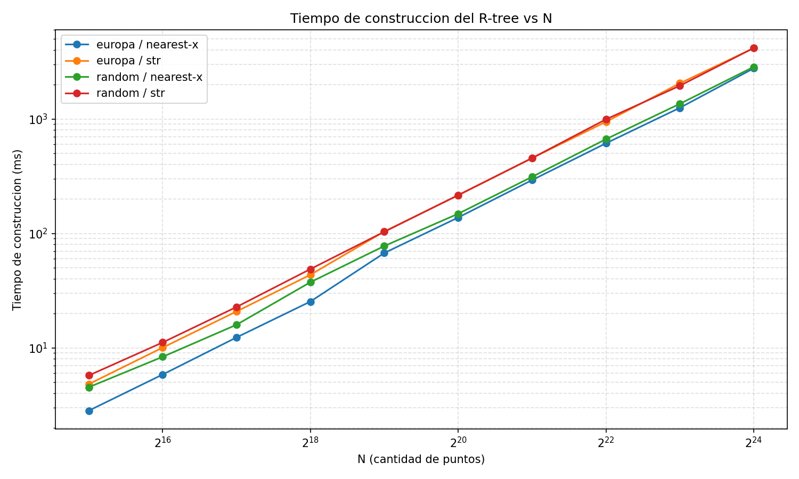
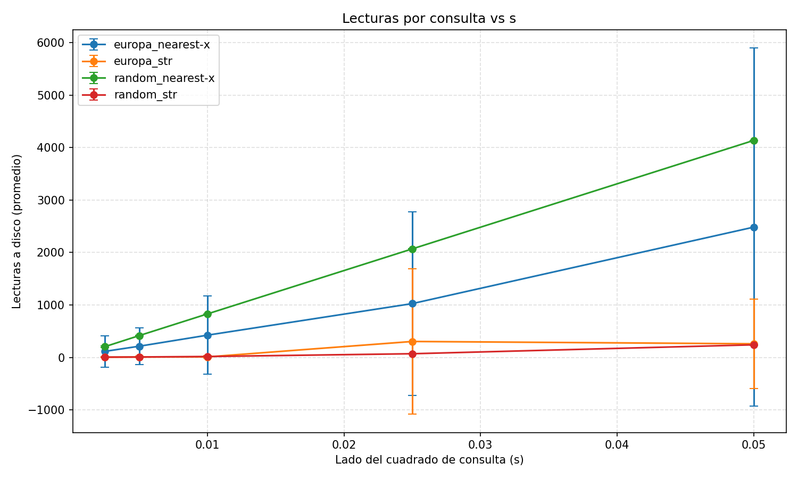
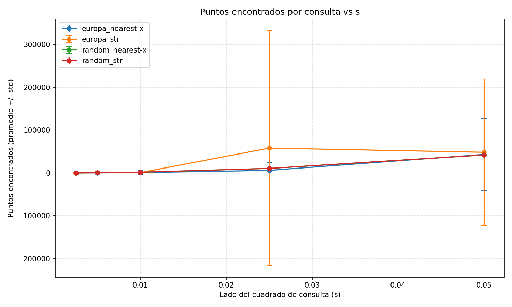

# Reporte - R-tree con bulk-loading (Nearest-X y STR)

> Tarea 1, curso CC4102 (Diseno y Analisis de Algoritmos), DCC, U. de Chile, 2026-1.

## 1. Introduccion

Este reporte presenta una implementacion en C++17 de un R-tree para puntos en
dos dimensiones, construido mediante dos algoritmos de bulk-loading:
**Nearest-X** y **Sort-Tile-Recursive (STR)**. El arbol se serializa en disco
usando bloques del tamano de un nodo (4096 bytes, igual al tamano tipico de
un bloque de disco) y las consultas por rango leen los nodos directamente
desde el archivo binario.

Se evalua el rendimiento de ambos metodos sobre dos datasets:

- **Aleatorio**: puntos uniformes en `[0,1] x [0,1]`.
- **Europa**: ubicaciones reales de edificios en Europa, normalizadas al
  mismo rango.

En lo que sigue se describe la implementacion (decisiones de diseno y
estructuras de datos), se reportan tiempos de construccion para
`N in {2^15, ..., 2^24}`, lecturas a disco y puntos encontrados durante
consultas con cuadrados de lado `s in {0.0025, 0.005, 0.01, 0.025, 0.05}`,
y se discuten los resultados a la luz de la teoria de R-trees.

**Hipotesis.** STR deberia producir arboles con MBRs mas equilibrados que
Nearest-X (porque considera ambas dimensiones al particionar) y, por lo
tanto, **resolver consultas con menos lecturas a disco**, especialmente sobre
datos no uniformes (como Europa, donde la densidad de puntos varia
fuertemente con la geografia). En contrapartida, **STR deberia ser mas lento
al construir** porque requiere ordenamientos adicionales por slice.

## 2. Desarrollo

### 2.1 Estructuras de datos

El nodo del R-tree esta disenado para ocupar exactamente 4096 bytes
(`NODE_SIZE`):

```
struct Entry {           // 20 bytes
    MBR mbr;             //   4 floats  = 16 bytes
    int32_t child_idx;   //              4 bytes  (-1 si la entrada es hoja)
};

struct Node {            // 4096 bytes
    int32_t k;           //   4 bytes  (entradas validas, 1 <= k <= B)
    Entry entries[B];    //   B * 20   = 4080 bytes  (B = 204)
    char pad[12];        //   12 bytes (relleno hasta el bloque)
};
```

Dos `static_assert` en `rtree_node.hpp` garantizan en tiempo de compilacion
que `sizeof(Entry) == 20` y `sizeof(Node) == 4096`. Si por algun motivo el
compilador insertara padding, el codigo no compila (y por lo tanto no produce
resultados invalidos en disco).

Las entradas hoja se distinguen por tener `child_idx == -1` y MBR puntual
(`x1 == x2`, `y1 == y2`). Todas las entradas dentro de un mismo nodo son del
mismo tipo (todas hoja o todas internas), por lo que basta con revisar la
primera.

### 2.2 Bulk-loading Nearest-X

Sigue el algoritmo del enunciado: ordenar entradas por la coordenada X de su
centro, agrupar de a `B` consecutivas para formar nodos hijo, generar
entradas padre con sus MBRs y recurrir hasta que todo quepa en un nodo.

**Decision de implementacion**: el arbol se construye en un
`std::vector<Node>` con la **posicion 0 reservada para la raiz**. La
recursion empuja los nodos hijos en indices `>= 1` y solo escribe en el
indice 0 cuando el caso base se alcanza (todas las entradas caben en un
nodo). Esto se logra con dos funciones internas: `nearestXRecursive` (caso
recursivo) y `writeRoot` (caso base).

Para ordenar se compara `x1 + x2` (en vez de `(x1 + x2) / 2`): es
monotonicamente equivalente al centro pero evita una division por cada
comparacion.

Para evitar `realloc`s caros del vector, se reserva capacidad inicial con la
estimacion `n / (B - 1) + B`, una cota superior holgada del numero total de
nodos (suma de la serie geometrica `1 + 1/B + 1/B^2 + ...`).

### 2.3 Bulk-loading STR

Tambien sigue el algoritmo del enunciado: ordenar por X, partir en `S`
slices verticales, y dentro de cada slice ordenar por Y y partir en grupos
de tamano `B`. Se eligio `S = ceil(sqrt(ceil(n/B)))`.

Con esa eleccion, el numero total de grupos es aproximadamente
`S * ceil((n/S)/B) ~= n/B`, igual al de Nearest-X. La diferencia esta en la
forma de los MBRs: STR produce grupos mas "cuadrados" porque particiona
sobre ambas dimensiones; Nearest-X produce grupos largos en Y.

### 2.4 Consultas y I/O por bloque

`queryRange` abre el archivo binario del arbol con `std::ifstream` y desciende
desde la posicion 0 (raiz). Para cada nodo:

- Si es hoja: revisa cada entrada y filtra los puntos contenidos en el query.
- Si es interno: para cada entrada cuyo MBR intersecta el query, llama
  recursivamente a su hijo.

Cada lectura de un nodo (con `seekg(idx * NODE_SIZE)` + `read(NODE_SIZE)`)
incrementa la variable global `g_disk_reads`. La consulta nunca usa el
`std::vector<Node>` que existio durante la construccion: solo lee desde el
archivo serializado, como exige el enunciado.

### 2.5 Decisiones adicionales

- Los datasets se leen una sola vez en RAM al inicio del experimento; los
  subconjuntos para distintos `N` se construyen como `std::vector<Point>`
  copiados desde el comienzo del vector original.
- La semilla del generador aleatorio para los queries esta fija (`42`) para
  que las corridas sean reproducibles.
- La desviacion estandar reportada es la **poblacional**
  (`sqrt(sum((x - mean)^2) / n)`), no la muestral.
- El subcomando `bonus` usa STR por defecto (mejor balanceo en datos no
  uniformes); puede cambiarse facilmente en `experiment.cpp`.

## 3. Resultados

### 3.1 Entorno de ejecucion

> _Llenar con los datos del entorno donde se corrieron los experimentos._

| Atributo            | Valor              |
| ------------------- | ------------------ |
| Sistema operativo   | _(placeholder)_    |
| CPU                 | _(placeholder)_    |
| Memoria RAM         | _(placeholder)_    |
| Cache L1 / L2 / L3  | _(placeholder)_    |
| Disco               | _(placeholder)_    |
| Compilador y flags  | g++ -O2 -std=c++17 |

### 3.2 Tiempos de construccion

Construcciones realizadas para `N in {2^15, ..., 2^24}` con cada combinacion
dataset x metodo. Tiempos en milisegundos.

<!-- Generado por: python plots/plot_construction.py results/build_times.csv results/build_times.png -->



> _Comentar brevemente lo que se observa en el grafico (sin todavia analizar):
> ej. "STR es mas lento que Nearest-X por un factor de ~X"._

### 3.3 Consultas

Para cada uno de los 4 arboles con `N = 2^24`, se generaron 100 cuadrados
aleatorios de lado `s in {0.0025, 0.005, 0.01, 0.025, 0.05}` y se midio:

- Cantidad promedio de lecturas a disco por consulta.
- Cantidad promedio de puntos encontrados (con barras de error = desviacion
  estandar).

<!-- Generados por: python plots/plot_queries.py results/query_stats.csv results/ -->





> _Comentar brevemente lo observable: ej. "el dataset Europa requiere mas
> lecturas que el aleatorio para el mismo s; STR sistematicamente reduce las
> lecturas frente a Nearest-X"._

### 3.4 Verificacion

Con `s = 0.01` sobre el dataset aleatorio (puntos uniformes en
`[0,1] x [0,1]`), se espera encontrar aproximadamente el `0.01%` del total,
es decir `~1678` puntos para `N = 2^24 = 16,777,216`.

> _Reportar el valor observado para validar que las consultas funcionan._

## 4. Analisis

> _Discutir los resultados a partir de lo observado en la seccion anterior._

Puntos a abordar:

1. **Tiempo de construccion (Nearest-X vs STR).** Se espera que STR sea mas
   lento por los ordenamientos por slice; el sobrecosto deberia ser un factor
   constante (no asintotico) ya que ambos algoritmos son
   `O(n log n)` por nivel y `O(log n)` niveles.
2. **Lecturas por consulta.** STR deberia leer menos nodos: al producir MBRs
   mas balanceados, hay menos solapamientos espurios y por lo tanto menos
   ramas exploradas. La diferencia deberia ser mayor en Europa que en
   aleatorio (la distribucion no uniforme de Europa hace que Nearest-X
   genere slices Y muy largos en zonas densas).
3. **Comportamiento vs `s`.** Tanto las lecturas como los puntos encontrados
   deberian crecer aproximadamente con `s^2` (area del query). Una verifica
   util es que la pendiente del log-log de lecturas/puntos vs `s` este cerca
   de 2.
4. **Variabilidad (std).** En el dataset Europa la desviacion estandar de
   los puntos encontrados deberia ser mucho mayor que en el aleatorio,
   reflejando que algunas regiones (centros urbanos) son mucho mas densas
   que otras (mar, montanas).

> _Concluir si la hipotesis se sostiene a la luz de los resultados._

## 5. Conclusion

> _Recapitulacion de lo realizado y de los hallazgos principales._

Trabajo a futuro:

- Comparar con otros algoritmos de bulk-loading (Hilbert R-tree, packed
  R-tree).
- Implementar un buffer/cache de nodos en RAM para amortizar lecturas en
  consultas que vuelven a tocar nodos ya leidos (especialmente la raiz).
- Probar `mmap` en vez de `seekg + read` y comparar overhead.
- Variar el factor de ramificacion `B` y medir su impacto en altura,
  lecturas y tiempo de construccion.
- Paralelizar la construccion (los slices de STR son independientes).

## 6. Bonus

Construccion de un R-tree (con STR) sobre `europa_bonus.bin`, que contiene
las coordenadas reales (longitud, latitud) de los edificios europeos en
aprox. `[-11, 35] x [35, 72]`.

**Ubicacion elegida:** _(placeholder, ej. Madrid centro
`(-3.7, 40.4)`, rectangulo `[-3.9, -3.5] x [40.3, 40.6]`)._

<!-- Generado por: python plots/plot_bonus.py results/bonus_madrid.csv results/bonus_madrid.png --label "Madrid" --center -3.7 40.4 -->


> _Comentar la cantidad de puntos encontrados y, si aplica, lo que se ve en
> el scatterplot (ej. trazos de avenidas o el contorno de la ciudad)._
